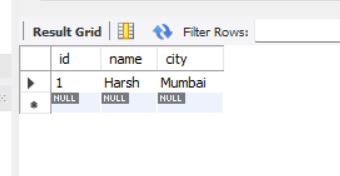
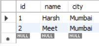
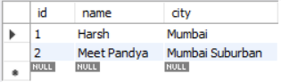
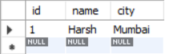

# About Spring JDBC

- Learn about Java Database Connectivity [here](https://github.com/codophilic/LearnWebDevInJAVA/blob/main/Theory.md#jdbc-java-database-connectivity).
- JDBC (Java Database Connectivity) is an application programming interface (API) that defines how a client may access a database. It is a data access technology used for Java database connectivity. It provides methods to query and update data in a database and is oriented toward relational databases.
- Spring Data JDBC, part of the larger Spring Data family, makes it easy to implement JDBC based repositories. This module deals with enhanced support for JDBC based data access layers. It makes it easier to build Spring powered applications that use data access technologies.
- Spring JDBC provides additional module along with JDBC.

## Problems when used only JDBC
- Requires to write lot of codes. For example we need to open connections , close connections multiple times, write statements and everything. Change in a table involes changes in code wherever the table used.
- It involved multiple try and SQLException block.
- Repeating of all these codes from one to another database is time consuming.
- Solution to such problems are provided by JDBC.

## JdbcTemplate
- Spring provides a **JdbcTemplate** which has all the important methods to perform operations to database.
- To execute sql queries using JdbcTemplate we require one object of JdbcTemplate,. Now JdbcTemplate depends on dataSource object, but here dataSource is an interface.
- DriverManagerDataSource is a class which implements dataSource interface. So basically DriverManagerDataSource object can be used for JdbcTemplate.
- So we will inject DriverManagerDataSource bean into JdbcTemplate.

- Lets say we create a schema with name springJdbc which has a table student and one data entry.

```
create table student(
id int primary key,
name varchar(100) not null,
city varchar(100) not null);

insert into student(id,name,city) values(1,'Harsh','Mumbai');
```

- Below is the Student class

```
package Spring.JDBC;

public class Student {

	private int id;
	private String name;
	private String city;
	public int getId() {
		return id;
	}
	public void setId(int id) {
		this.id = id;
	}
	public String getName() {
		return name;
	}
	public void setName(String name) {
		this.name = name;
	}
	public String getCity() {
		return city;
	}
	public void setCity(String city) {
		this.city = city;
	}
	@Override
	public String toString() {
		return "Student [id=" + id + ", name=" + name + ", city=" + city + "]";
	}

}

```

- Below is the configuration required to with to start with Spring JDBC.

```
<?xml version="1.0" encoding="UTF-8"?>


<beans xmlns="http://www.springframework.org/schema/beans"
       xmlns:xsi="http://www.w3.org/2001/XMLSchema-instance"
       xmlns:context="http://www.springframework.org/schema/context"
       xmlns:p="http://www.springframework.org/schema/p"
       xmlns:util="http://www.springframework.org/schema/util"
       xmlns:c="http://www.springframework.org/schema/c"
       xsi:schemaLocation="http://www.springframework.org/schema/beans
                           http://www.springframework.org/schema/beans/spring-beans.xsd
                           http://www.springframework.org/schema/context
                           http://www.springframework.org/schema/context/spring-context.xsd
                           http://www.springframework.org/schema/util
                           http://www.springframework.org/schema/util/spring-util.xsd" >	
	
	<!-- 
	Define JdbcTemplate and its class
	org.springframework.jdbc.core.JdbcTemplate is a class which has DataSource as one of its argument in the
	constructor , so the org.springframework.jdbc.core.JdbcTemplate class requires class of DataSource.
	Now DataSource is an interface, but we have DriverMangerDataSource which implements DataSource
	
	In DriverManagerDataSource , we need to give database details like
	1. URL
	2. Username
	3. DB name
	4. password
	 -->
	 
	 <bean name="driverManagerDataSource" class="org.springframework.jdbc.datasource.DriverManagerDataSource">
	 	<property name="driverClassName" value="com.mysql.jdbc.Driver"></property>
	 	<property name="url" value="jdbc:mysql://localhost:3306/springjdbc"></property>
	 	<property name="username" value="root"></property>
	 	<property name="password" value="Meetpandya40@"></property>
	 
	 </bean>
	<bean name="jdbcTemplate" class="org.springframework.jdbc.core.JdbcTemplate" >
		<property name="dataSource" ref="driverManagerDataSource"/>
	</bean>
</beans>
```

- Post running an insert query in main method we can see result

```
package Spring.JDBC;

import org.springframework.context.support.ClassPathXmlApplicationContext;
import org.springframework.jdbc.core.JdbcTemplate;

/**
 * Hello world!
 *
 */
public class SpringJDBCMainMethod 
{
    public static void main( String[] args )
    {
		ClassPathXmlApplicationContext factory = new ClassPathXmlApplicationContext("Spring/JDBC/springjdbc.xml");
		JdbcTemplate jdbcTemplate=factory.getBean("jdbcTemplate",JdbcTemplate.class);
		
		/**
		 * Insert Operation example
		 */
		String sql="insert into student(id,name,city) values (?,?,?)";
		int result=jdbcTemplate.update(sql,1,"Harsh","Mumbai");
		System.out.println("Rows affected - "+result);
    }
}

Output:
Rows affected - 1
```




- In the insert query we can se **?** are added in values. What is it? the **?** symbols in the query are placeholders for parameters, which help prevent SQL injection and simplify the process of setting values dynamically.
- The **?** placeholders are part of the PreparedStatement mechanism, which offers several advantages like prevents SQL Injection, provides good performance and simplicity in code.
- Lets say we create a proper DAO layer, where we will have DAO interface and class which implements the interface. The DAO interface layer will just declare all the CRUD methods and another class will implement all those methods.
- Below is the DAO interface.

```
package Spring.JDBC.dao;

import Spring.JDBC.Student;

public interface DAOInterface {
	
	/**
	 * Declaring all the CRUD methods.
	 * 
	 * Create,update and delete will always return an integer value which states that
	 * how many rows are affected post operation
	 */
	
	public int create(Student student);
	public int update(Student student);
	public int delete(Student student);

}
```

- Below is the implementation of the interface.

```
package Spring.JDBC.dao;

import org.springframework.jdbc.core.JdbcTemplate;

import Spring.JDBC.Student;

public class DAOImpl implements DAOInterface{
	
	/**
	 * To execute SQL queries we require JDBC template
	 * the bean for this will be injected via config xml
	 */
	private JdbcTemplate jdbcTemplate;

	public JdbcTemplate getJdbcTemplate() {
		return jdbcTemplate;
	}

	public void setJdbcTemplate(JdbcTemplate jdbcTemplate) {
		this.jdbcTemplate = jdbcTemplate;
	}

	@Override
	public int create(Student student) {
		String sql="insert into student(id,name,city) values (?,?,?)";
		int result=jdbcTemplate.update(sql,student.getId(),student.getName(),student.getCity());
		return result;
	}

	@Override
	public int update(Student student) {
		String sql="update student set name=? , city=? where id=?";
		int result=jdbcTemplate.update(sql,student.getName(),student.getCity(),student.getId());
		return result;		
	}

	@Override
	public int delete(Student student) {
		String sql="delete from student where id=?";
		int result=jdbcTemplate.update(sql,student.getId());
		return result;			
	}

}

```

- Below is the main method which performs only insertion.

```
package Spring.JDBC;

import org.springframework.context.support.ClassPathXmlApplicationContext;
import org.springframework.jdbc.core.JdbcTemplate;

import Spring.JDBC.dao.DAOInterface;

/**
 * Hello world!
 *
 */
public class SpringJDBCMainMethod 
{
    public static void main( String[] args )
    {
		ClassPathXmlApplicationContext factory = new ClassPathXmlApplicationContext("Spring/JDBC/springjdbc.xml");
		JdbcTemplate jdbcTemplate=factory.getBean("jdbcTemplate",JdbcTemplate.class);
		
		/**
		 * Insert Operation example
		 */
//		String sql="insert into student(id,name,city) values (?,?,?)";
//		int result=jdbcTemplate.update(sql,1,"Harsh","Mumbai");
//		System.out.println("Rows affected - "+result);
		
		DAOInterface stdao=factory.getBean("daolayer",DAOInterface.class);
		
		/**
		 * This below values will come from a service layer 
		 * when we build a web application
		 */
		Student st=new Student();
		
		/**
		 * Insert Operation via DAO Layer
		 */
		st.setId(2);
		st.setName("Meet");
		st.setCity("Mumbai");
		System.out.println("Insert Operation is performed, rows affected - "+stdao.create(st));
		
    }
}

Output:
Insert Operation is performed, rows affected - 1
```




- Lets look when we do update operation, so here we are updating row id 2 with new name and new city.

```
		/**
		 * Update Operation for row id 2
		 */
		st.setId(2);
		st.setName("Meet Pandya");
		st.setCity("Mumbai Suburban");
		System.out.println("Update Operation is performed, rows affected - "+stdao.update(st));

Output:
Update Operation is performed, rows affected - 1
```



- Lets see delete operation, lets delete row id 2.

```
		st.setId(2);
		System.out.println("Delete Operation is performed, rows affected - "+stdao.delete(st));

Output:
Delete Operation is performed, rows affected - 1
```



- We have saw create, update and delete operations, lets see how select statement works. Originally in JDBC we use to use **ResultSet** class to iterate over the select statement values. Consider the below sample which is a oldest approach used for select statements.

```
     try {
            // 1. Establish connection to the database
            connection = DriverManager.getConnection(URL, USER, PASSWORD);

            // 2. Prepare SQL statement
            String sql = "SELECT * FROM Person";
            preparedStatement = connection.prepareStatement(sql);

            // 3. Execute query and get result set
            resultSet = preparedStatement.executeQuery();

            // 4. Iterate through result set and map data to Person objects
            while (resultSet.next()) {
                Person person = new Person();
                person.setId(resultSet.getInt("id"));
                person.setName(resultSet.getString("name"));
                persons.add(person);
            }
        } catch (SQLException e) {
            e.printStackTrace(); // Handle exception appropriately
        } finally {
            // 5. Close resources
            try {
                if (resultSet != null) resultSet.close();
                if (preparedStatement != null) preparedStatement.close();
                if (connection != null) connection.close();
            } catch (SQLException e) {
                e.printStackTrace(); // Handle exception appropriately
            }
        }
```

- Here we iterate over the Resultset and append those in the defined class using List. What if these piece of code is automatically handle by Spring? yes, we have **RowMapper** in JdbcTemplate which does these things.
- Now **RowMapper** is an interface, if we want to use it we need to implement RowMapper interface with our class.
- Below is the example how we have implemented RowMapper for Student class.

```
package Spring.JDBC.dao;

import java.sql.ResultSet;
import java.sql.SQLException;

import org.springframework.jdbc.core.RowMapper;

import Spring.JDBC.Student;

public class RowMapperImpl implements RowMapper<Student> {
	
	/**
	 * RowMapper is an interface which has a default mapRow abstract method in it.
	 * So here we need to set that which all columns needs to be mapped 
	 * with the Student instance variable.
	 */

	@Override
	public Student mapRow(ResultSet rs, int rowNum) throws SQLException {
		Student st=new Student();
		st.setId(rs.getInt(1));
		st.setName(rs.getString(2));
		st.setCity(rs.getString(3));
		return st;
	}

}
```

- DAO implementation for a single query

```
	@Override
	public Student selectSingleRow(Student student) {
		String sql="Select * from student where id=?";
		RowMapper<Student> rowmapper=new RowMapperImpl();
		Student st=jdbcTemplate.queryForObject(sql,rowmapper,student.getId());
		return st;	
	}
```

- Post main method execution we get the output.

```
		/**
		 * Select Single row
		 */
		st.setId(1);
		System.out.println("Single row data for student class - "+stdao.selectSingleRow(st).toString());

Output:
Single row data for student class - Student [id=1, name=Harsh, city=Mumbai]
```

- To select all data from table

```
	@Override
	public List<Student> allStudentData() {
		String sql="Select * from student";
		List<Student> st=jdbcTemplate.query(sql, new RowMapperImpl());
		return st;
	}
```

- Post main method execution, we get output.

```
		/**
		 * Select All the rows
		 */
		
		System.out.println("All row data for student class");
		List<Student> allstudents=stdao.allStudentData();
		for(Student s: allstudents) {
			System.out.println(s.toString());
		}

Output:
All row data for student class
Student [id=1, name=Harsh, city=Mumbai]
```

- A RowMapper is an interface that defines how rows from a ResultSet are mapped to a specific type of object. It is commonly used to convert each row of a SQL query result into an instance of a class, providing a convenient way to handle the data retrieved from the database.
- The RowMapper interface is useful because it abstracts the process of extracting data from the ResultSet and converting it into the desired type. This not only makes the code more readable but also allows for reuse and better separation of concerns.

- Now lets learn [Spring ORM](https://github.com/codophilic/LearnSpring/blob/main/Spring%20%ORM.md)


