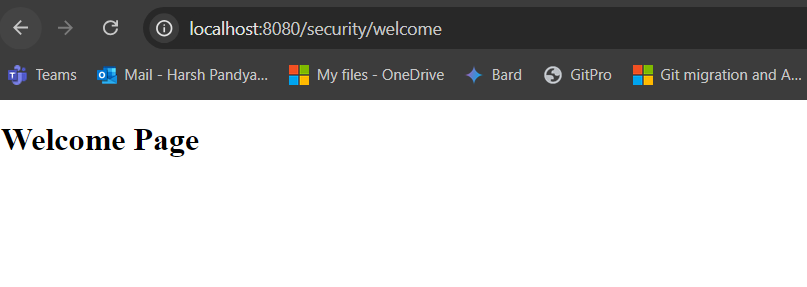

# About Security
- In the world of web applications and APIs, security means protecting your data, your users' data, and the integrity of your application.
- **Without Security:**
  - A website without security is like an open house on the internet. Hackers can easily access your data, steal customer information, or even take control of your website. For instance, an online shopping website without security would allow anyone to see and change order details, customer addresses, and payment information.
- **With Security:**  
  - A secure website is like a house with a strong lock. Only authorized users can access specific information. For instance, an online banking website uses encryption to protect your account details, ensuring only you can access your money.
- The term **security** refers to protecting the application and its data from unauthorized access and malicious activities. It involves ensuring that only the right people can access certain parts of the application and perform specific actions.
- So security is important for your web application, but what type of security measures you need to consider while developing your application?
- Some of the common security measures:
  - **Encryption**: This is like scrambling data so only those with the right key (password) can understand it.
  - **Authentication**: This verifies who you are (username and password).
  - **Authorization**: This determines what you can do (access levels).
  - **Firewalls**: These act as guards, preventing unauthorized access.
  - **Intrusion Detection Systems**: These watch for suspicious activity.  
- There are many other security measures which are important. All such measures have been defined by OWASP [Open Web Application Security Project](https://owasp.org/www-project-top-ten/).


- OWASP release top 10 security measure every 4 years, which states new security measure or any update in existing. So referring all such security measure you need to implement in your application making it robust from any kind of attacks.
- So one can implement manually all these security controls or we have spring security which has built-in measure for most of the securities aspects.
- Reference [video](https://www.youtube.com/watch?v=2tf0UY6gV3Y)

# About Spring Security
- Lets say you are building a web application which consist of private pages. These private pages will be accessible only to particular user, now to make a page you need to have a login page.
- Now when you are designing your page you need to main the user details, typically name and password, so now you require database, but do you will save it in plain text? nope, you would have encryption or SHA-256 logic but even after that such methods were hack, so we have LDAP, OAuth and other login security controlls.
- Spring provides bundle of this as its in-build methods.
- Before diving into technical part first let us understand spring security flow.


- Spring security maintain a chain of filters for doing authentication and authorization. It has filters for providing different features and they are arranged in a predefined order e.g. it has got a ConcurrentSessionFilter to prevent concurrent sessions from same user.
- Authentication means who you are ? whereas Authorization means i know you but what is your role (admin, user, staff etc.) to access this page ?
- In order to enable Spring security in your Java web application, you need to declare this **DelegatingFilterProxy** filter in your **web.xml**, just like any other filter but you must specify the name as **springSecurityFilterChain**. The name is very important because the **DelegatingFilterProxy** which implements FilterChain interface delegates request to filter named **springSecurityFilterChain**.
- Spring security layers are the filters or interceptors which performs security checks using FilterChainProxy and different security filters mentioned.
- When an HTTP request hit the web-server it is handed over to **DelegatingFilterProxy** because its generally configured to intercept all request by specifying wild card (*) in its url-pattern. The DelegatingFilterProxy then pass this request to all the filters which are part of springSecurityFilterChain.

### Spring Security Flow
- **Client Request**: A client sends a request to the Spring Boot application.
- **Servlet Container**: The embedded servlet container (e.g., Tomcat) receives the request.
- **DelegatingFilterProxy**:
	-  DelegatingFilterProxy is a special type of filter that acts as a bridge between the servlet container and the Spring application context.
	- It delegates the actual work of handling the security-related request to a Spring-managed bean that implements the Filter interface.
	- In Spring application, you need to defined in web.xml.
	- DelegatingFilterProxy itself does not handle security logic. Instead, it delegates to another filter bean defined in the Spring application context, usually **FilterChainProxy**.
- **FilterChainProxy**:
	- FilterChainProxy is a filter that manages a list of security filters defined by Spring Security.
	- It contains the actual security filters (like authentication and authorization filters) and applies them in a specific order to the request.
	- When FilterChainProxy receives the request from **DelegatingFilterProxy**, it consults the **SpringSecurityFilterChain** to determine which filters to apply.
	- These filters are then applied in sequence to the request.
- **Security Filters:**
	- UsernamePasswordAuthenticationFilter: Handles form-based login.
	- BasicAuthenticationFilter: Handles HTTP Basic authentication.
	- CsrfFilter: Provides CSRF protection.
	- SecurityContextPersistenceFilter: Manages the SecurityContext for the request.
	- ExceptionTranslationFilter: Translates security exceptions to HTTP responses.
	- **Flow**: Each filter performs a specific task and passes the request to the next filter in the chain if the task is successfully completed. If any filter fails, it may interrupt the flow and return a response immediately (e.g., an unauthorized error).
 	- Filters like UsernamePasswordAuthenticationFilter and BasicAuthenticationFilter intercept the request to perform authentication. These filters use the **Authentication Manager** to process the authentication request.
  		- **Authentication Manager**
    			-  Receives the authentication request from the filter (e.g., username and password).
			- Validates the credentials against the configured user details service or authentication provider.
			- If authentication is successful, returns an Authentication object.
    		- **Security Context**
			- The Security Context holds the authenticated user's details, including their roles and authorities (permissions).
			- This information is stored in an Authentication object, which is held in the **SecurityContextHolder**.
    		-  **Authorization**:
			- Authorization Filters: Filters like AuthorizationFilter use the information in the Security Context to check if the authenticated user has the necessary permissions to access a particular resource.
			- During the request processing, the Security Context is consulted to determine if the user has the required authorities (roles/permissions) to perform specific actions.
- **Servlet**: After passing through all security filters, the request reaches the servlet, which processes it and generates a response. The response goes back through the filter chain (if any post-processing is required) and is sent back to the client.
- By using **DelegatingFilterProxy**, **FilterChainProxy**, and **SpringSecurityFilterChain**, Spring Security provides a flexible and powerful way to handle various security concerns in a modular and configurable manner.

- Lets create a spring mvc project, first lets download only spring dependencies and use java beans for spring based configuration.

```
  <dependency>
    <groupId>org.springframework</groupId>
    <artifactId>spring-webmvc</artifactId>
    <version>5.2.4.RELEASE</version>
</dependency>
```

- Below is the Spring configuration using Java beans, this is like a spring-servlet.xml like we have seen in [Spring MVC](https://github.com/codophilic/LearnSpring/blob/main/Spring%20MVC.md)

```
package security;

import org.springframework.context.annotation.*;
import org.springframework.web.servlet.ViewResolver;
import org.springframework.web.servlet.config.annotation.EnableWebMvc;
import org.springframework.web.servlet.config.annotation.WebMvcConfigurer;
import org.springframework.web.servlet.view.InternalResourceViewResolver;

@Configuration
@ComponentScan( basePackages = "security")
@EnableWebMvc
public class SpringConfiguration implements WebMvcConfigurer{

    // Creating InternalResourceViewResolver bean 
    @Bean
    public ViewResolver getInternalResourceViewResolver(){ 
        InternalResourceViewResolver viewResolver 
            = new InternalResourceViewResolver(); 
        
        // setting prefix and suffix to the path & extension 
        viewResolver.setPrefix("/WEB-INF/pages/"); 
        viewResolver.setSuffix(".jsp"); 
        return viewResolver; 
    }
}
```

- Here we are not writting anything in web.xml file , we will be creating a class of WebXML

```
package security.config;

import org.springframework.web.servlet.support.AbstractAnnotationConfigDispatcherServletInitializer;

import security.SpringConfiguration;

// This class serves as a replacement for the traditional web.xml file. 
// It initializes the Spring DispatcherServlet and specifies the configuration classes.

public class WebXML extends AbstractAnnotationConfigDispatcherServletInitializer {

    // This method returns the configuration classes for the root application context.
    // The root application context typically contains beans that are shared across the entire application.
    @Override
    protected Class<?>[] getRootConfigClasses() {
        return new Class[] { SpringConfiguration.class }; //spring-servlet.xml
    }

    // This method returns the configuration classes for the DispatcherServlet application context.
    // Since it returns null here, it means all configurations are provided by the root context.
    @Override
    protected Class<?>[] getServletConfigClasses() {
        return null;
    }

    // This method specifies the URL patterns that the DispatcherServlet will be mapped to.
    // In this case, it maps the DispatcherServlet to the root URL pattern ("/"),
    // meaning it will handle all incoming requests.
    @Override
    protected String[] getServletMappings() {
        return new String[] { "/" };
    }
}
```

- Below is the main controller 

```
package security;

import org.springframework.stereotype.*;
import org.springframework.web.bind.annotation.*;

@Controller
public class MainController {

	@RequestMapping("/welcome")
	public String welcomePage() {
		return "welcome";
	}
}
```

- Post execution when we hit the url `http://localhost:8080/security/welcome` we get below output.




- Uptil now we have not configure any security controll on our web project. Lets add 


