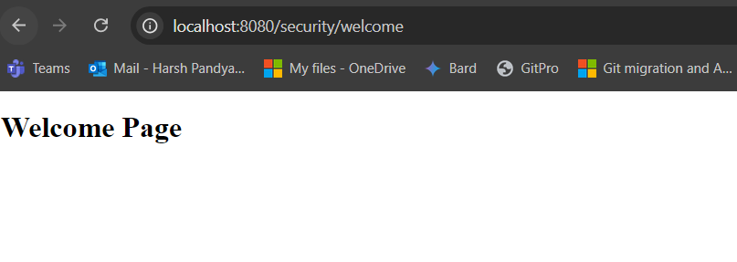

# About Spring MVC

- [Learn about MVC first](https://github.com/codophilic/LearnSpring/blob/main/Architectures%20and%20Design%20Pattern.md).
- Spring MVC is a sub-framework of Spring which is used to build web applications.
- It is built on a Servlet API
- Spring MVC provides additional component along with MVC design patterns.
- Lets understand the Spring MVC flow.

- Whenever client sents a request, the request first goes to the **FrontController** (also known as **DispatcherServlet**). The Spring Web model-view-controller (MVC) framework is designed around a **DispatcherServlet**.
- Now when the FrontController gets a request, it delegates the request to a **Controller/Handler**. Now there could be multiple controllers whats why one way to understand is that we have a **FrontController** decides to whom (Controller) it has to hand over the request, based on the URL mappings or **RequestMapping**. So lets say if client as enter `/getStudent` so the controller who manages the `/getStudent` url will be delegated by FrontController.
- The respected controller that took the request, processes the request, by sending it to suitable service class, if requires the DAO layers is access and the data is send back to the controller.
- The respected controller creates a model using the data. It also finds out which view or page is required to show this data.
- The controller passes or delegates the response with this created model and lookup view or page to the FrontController.
- Now the FrontController passes this response to **ViewResolver** which resolves the page name (This step involves determining which page template should be used to render the response) , figures out the page name and add this model data into the page, transforming it from static to dynamic web page and sends back to the FrontController.
- The FrontController sends back response to client.

- Lets start implementing it.
- Create a **maven-archetype-web** project and not quickstart project.