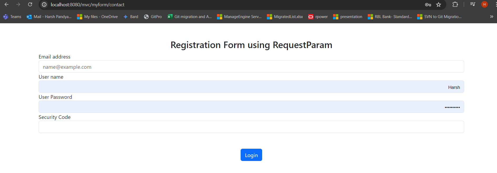

# About Spring MVC

- [Learn about MVC first](https://github.com/codophilic/LearnSpring/blob/main/Architectures%20and%20Design%20Pattern.md).
- Spring MVC is a sub-framework of Spring which is used to build web applications.
- It is built on a Servlet API
- Spring MVC provides additional component along with MVC design patterns.
- Lets understand the Spring MVC flow.


- Whenever client sents a request, the request first goes to the **Front Controller** (also known as **DispatcherServlet**). The Spring Web model-view-controller (MVC) framework is designed around a **DispatcherServlet**.
- Now when the Front Controller gets a request, it delegates the request to a **Controller/Handler**. Now there could be multiple controllers whats why one way to understand is that we have a **Front Controller** decides to whom (Controller) it has to hand over the request, based on the URL mappings or **RequestMapping**. So lets say if client as enter `/getStudent` so the controller who manages the `/getStudent` url will be delegated by Front Controller.
- The respected controller that took the request, processes the request, by sending it to suitable service class, if requires the DAO layers is access and the data is send back to the controller.
- The respected controller creates a model using the data. It also finds out which view or page is required to show this data.
- The controller passes or delegates the response with this created model and lookup view or page (**model and view**) to the Front Controller.
- Now the Front Controller passes this response to **ViewResolver** which resolves the page name (This step involves determining which page template should be used to render the response) , figures out the page name and add this model data into the page, transforming it from static to dynamic web page and sends back to the Front Controller.
- The Front Controller sends back response to client.


- Lets start implementing it.
- Create a **maven-archetype-web** project and not quickstart project.
- First we need to download the dependencies

```
<dependency>
  <groupId>javax.servlet</groupId>
  <artifactId>javax.servlet-api</artifactId>
  <version>3.0.1</version>
  <scope>provided</scope>
</dependency>
    
    <dependency>
    <groupId>org.springframework</groupId>
    <artifactId>spring-webmvc</artifactId>
    <version>5.2.4.RELEASE</version>
</dependency>
```

- Now we need to invoke Front Controller or DispatchServlet in the web xml on server startup.

```
<!DOCTYPE web-app PUBLIC
 "-//Sun Microsystems, Inc.//DTD Web Application 2.3//EN"
 "http://java.sun.com/dtd/web-app_2_3.dtd" >

<web-app>
  <display-name>Archetype Created Web Application</display-name>
  
  <!-- Configure Dispatcher Servlet -->
  <!-- So whenever the server is started up, Dispatcher Servlet will be invoked or initialized -->
    <servlet>
        <servlet-name>spring</servlet-name>
        <servlet-class>org.springframework.web.servlet.DispatcherServlet</servlet-class>
        <load-on-startup>1</load-on-startup>
    </servlet>

	<!--  
	Based on the mapping, if users enters the url any page using our context path (springmvc) , frontcontroller will accept the request
	  	URL examples
	  	- localhost:8080/springmvc/getPage
	  	- localhost:8080/springmvc/getPageinfo
	The DispatcherServlet will handle all requests under the context path /springmvc.
-->
    <servlet-mapping>
        <servlet-name>spring</servlet-name>
        <url-pattern>/</url-pattern>
    </servlet-mapping>
  <!-- 
  	How will spring know where the bean mapping is done? is it based on the servletName-servlet.xml
  	So basically here we have created a servlet name 'spring' (<servlet-name>spring</servlet-name>)
  	which is followed by Spring framework. So using the convection spring will get to know where are the bean mapping is done.
  	Spring looks for a file named servletName-servlet.xml (in this case, spring-servlet.xml) in the WEB-INF directory for configuration settings, including bean definitions and view resolver configurations.
   -->
</web-app>
```

- Now in the web.xml we have given spring as our servlet name, so we need to create a file with servletName-servlet.xml (under WEB-INF) folder where all the spring related configuration will be done.

```
<?xml version="1.0" encoding="UTF-8"?>


<beans xmlns="http://www.springframework.org/schema/beans"
       xmlns:xsi="http://www.w3.org/2001/XMLSchema-instance"
       xmlns:context="http://www.springframework.org/schema/context"
       xmlns:p="http://www.springframework.org/schema/p"
       xmlns:util="http://www.springframework.org/schema/util"
       xmlns:c="http://www.springframework.org/schema/c"
       xsi:schemaLocation="http://www.springframework.org/schema/beans
                           http://www.springframework.org/schema/beans/spring-beans.xsd
                           http://www.springframework.org/schema/context
                           http://www.springframework.org/schema/context/spring-context.xsd
                           http://www.springframework.org/schema/util
                           http://www.springframework.org/schema/util/spring-util.xsd" >

    <!--  Enabling Component Scanning Annotations  -->
	<context:component-scan base-package="springmvc.controller"/> 

<!-- Defining view resolver and passing properties of it, which it requires for resolving -->
<bean class="org.springframework.web.servlet.view.InternalResourceViewResolver" name="viewResolver">
	<!-- Prefix tells spring where all the pages are present -->
	<property name="prefix" value="/WEB-INF/pages/"></property>
	<!-- Suffix tells what extension of files are to be considered (here all .jsp files) -->
	<property name="suffix" value=".jsp"></property>
	
	<!-- Basically Controllers gives view name, FrontController passes this view to ViewResolver
		So example if Controller gives welcome, then the ViewResolver returns the page /WEB-INF/pages/welcome.jsp
	 -->
	
</bean>

</beans>
```

- Here for Spring we will be using annotation based configuration, so we have create a MainController which is our Front Controller and we have provided various RequestMapping which basically tells Front Controller that if any url ending with `welcome` call this method and take the view name from that method.

```
package mvc.controller;

import org.springframework.stereotype.Controller;
import org.springframework.web.bind.annotation.RequestMapping;

/**
 * Front Controller, this controller acts as a front controller in the MVC pattern
 */
@Controller
public class MainController {

	/**
	 * URL -> http://localhost:8080/mvc/welcome
	 */
	@RequestMapping("/welcome")
	public String welcome() {
		System.out.println("Returns page name welcome, thus /WEB-INF/pages/welcome.jsp");
		return "welcome";
	}
	
	/**
	 * URL -> http://localhost:8080/mvc/error
	 */
	@RequestMapping("/error")
	public String error() {
		System.out.println("Returns page name error, thus /WEB-INF/pages/error.jsp");
		return "error";
	}
	
	
}
Output:
Returns page name welcome, thus /WEB-INF/pages/welcome.jsp
Returns page name error, thus /WEB-INF/pages/error.jsp
```

- Welcome page url : http://localhost:8080/mvc/welcome

 

- Error page url : http://localhost:8080/mvc/error 

  

- Default page url : http://localhost:8080/mvc/ 


>[!IMPORTANT]
> The default page url end-point does not have /index. If you add it , you will get recieve 404 tomcat error details page.
> Don't append .jsp sufix at the end of your page name. It will be only url.
> If we organize jsp files into different folders, then we need to specify `<property name="prefix" value="/WEB-INF/"></property>` as prefix in spring-servlet.xml and need to ensure that method which returns the view must also return the corresponding folder name and jsp file name, so example for above code will be like "pages/welcome" , "pages/error" . This will help ViewResolver to find the path using prefix value which are `/WEB-INF/pages/welcome.jsp` or `/WEB-INF/pages/error.jsp`.


- The above examples were based on static page, now lets work with dynaminc page. So to add dynamic data into view, controller provides a model and view in an Object.
- Let us see in the below example, we have an JSP file which display the value generated by the controller.

```
package mvc.controller;

import java.util.ArrayList;
import java.util.List;

import org.springframework.stereotype.Controller;
import org.springframework.ui.Model;
import org.springframework.web.bind.annotation.RequestMapping;

/**
 * Front Controller, this controller acts as a front controller in the MVC pattern
 */
@Controller
public class MainController {

	/**
	 * URL -> http://localhost:8080/mvc/welcome
	 */
	@RequestMapping("/welcome")
	public String welcome() {
		System.out.println("Returns page name welcome, thus /WEB-INF/pages/welcome.jsp");
		return "welcome";
	}
	
	/**
	 * URL -> http://localhost:8080/mvc/error
	 */
	@RequestMapping("/error")
	public String error() {
		System.out.println("Returns page name error, thus /WEB-INF/pages/error.jsp");
		return "error";
	}
	
	/**
	 * URL -> http://localhost:8080/mvc/modelData
	 */
	@RequestMapping("/modelData")
	public String modelDataPageDetails(Model model) {
		
		/**
		 * Adding all the data into an object model
		 * providing a attribute key-name and a value.
		 * This value is fetched from HttpsRequest in JSP
		 */
		model.addAttribute("name","Harsh");
		model.addAttribute("age",22);
		List<String> techstacks=new ArrayList<>();
		techstacks.add("Spring MVC");
		techstacks.add("Java");
		model.addAttribute("alltechstacks",techstacks);
		return "modelData";
	}
	
	
}
```

- Below is the JSP file for modelData.jsp

```
<%@ page language="java" contentType="text/html; charset=UTF-8"
    pageEncoding="UTF-8"%>
<!DOCTYPE html>
<html>
<head>
<meta charset="UTF-8">
<title>Model data</title>
</head>
<body>
	<h1>Display Data using Model Only</h1>
	<!-- JSP files is converted into servlet by tomcat -->
	<%@ page import="java.util.List" %>
	
	<% 
	String name=(String)request.getAttribute("name");
	Integer age=(Integer)request.getAttribute("age");
	List<String> alltechs=(List<String>) request.getAttribute("alltechstacks");
	%>
	
	<p>
	Name is <%=name %><br/>
	Age is <%=age %><br/>
	List of techs: </br>
	<%
		for(String i : alltechs){
			
			out.println(i); 	%> </br>
	<%

		}
	
	%>
	
	</p>
	
</body>
</html>
```

- Post Execution of MainController 

```
package mvc.controller;

import java.util.ArrayList;
import java.util.List;

import org.springframework.stereotype.Controller;
import org.springframework.ui.Model;
import org.springframework.web.bind.annotation.RequestMapping;

/**
 * Front Controller, this controller acts as a front controller in the MVC pattern
 */
@Controller
public class MainController {

	/**
	 * URL -> http://localhost:8080/mvc/welcome
	 */
	@RequestMapping("/welcome")
	public String welcome() {
		System.out.println("Returns page name welcome, thus /WEB-INF/pages/welcome.jsp");
		return "welcome";
	}
	
	/**
	 * URL -> http://localhost:8080/mvc/error
	 */
	@RequestMapping("/error")
	public String error() {
		System.out.println("Returns page name error, thus /WEB-INF/pages/error.jsp");
		return "error";
	}
	
	/**
	 * URL -> http://localhost:8080/mvc/modelData
	 */
	@RequestMapping("/modelData")
	public String modelDataPageDetails(Model model) {
		
		/**
		 * Adding all the data into an object model
		 * providing a attribute key-name and a value.
		 * This value is fetched from HttpsRequest in JSP
		 */
		model.addAttribute("name","Harsh");
		model.addAttribute("age",22);
		List<String> techstacks=new ArrayList<>();
		techstacks.add("Spring MVC");
		techstacks.add("Java");
		model.addAttribute("alltechstacks",techstacks);
		return "modelData";
	}
	
	
}
```

 

- Hold on, similar approach is been seen when we take values from normal servlet class and feed those values in JSP. In Spring MVC the controller sents model as well as view right? the Controller passes the view and model to viewResolver, here above we are passing only model.
- This is one of the approach to sent data to the viewResolver where the dynamic content is fetched from `request.getAttribute()`.
- Lets see how to pass both model as well as view.
- Below is modelAndView.jsp

```
<%@ page language="java" contentType="text/html; charset=UTF-8"
    pageEncoding="UTF-8"%>
<!DOCTYPE html>
<html>
<head>
<meta charset="UTF-8">
<title>Model and View</title>
</head>
<body>
<h1>Display Data using Model And View Only</h1>
	<!-- JSP files is converted into servlet by tomcat -->
	<%@ page import="java.util.List" %>
	
	<% 
	String name=(String)request.getAttribute("name");
	Integer age=(Integer)request.getAttribute("age");
	List<String> alltechs=(List<String>) request.getAttribute("alltechstacks");
	%>
	
	<p>
	Name is <%=name %><br/>
	Age is <%=age %><br/>
	List of techs: </br>
	<%
		for(String i : alltechs){
			
			out.println(i); 	%> </br>
	<%

		}
	
	%>
	
	</p>
</body>
</html>
```

- Post execution we can see the output.

```
package mvc.controller;

import java.util.ArrayList;
import java.util.List;

import org.springframework.stereotype.Controller;
import org.springframework.ui.Model;
import org.springframework.web.bind.annotation.RequestMapping;
import org.springframework.web.servlet.ModelAndView;

/**
 * Front Controller, this controller acts as a front controller in the MVC pattern
 */
@Controller
public class MainController {

	/**
	 * URL -> http://localhost:8080/mvc/modelAndView
	 */
	@RequestMapping("/modelAndView")
	public ModelAndView sendModelviewData() {
		ModelAndView mav=new ModelAndView();
		/**
		 * Add all the data object in ModelAndView
		 */
		
		mav.addObject("name","Harsh");
		mav.addObject("age",22);
		List<String> techstacks=new ArrayList<>();
		techstacks.add("Spring MVC");
		techstacks.add("Java");
		mav.addObject("alltechstacks",techstacks);
		
		/**
		 * Add the view name 
		 */
		mav.setViewName("modelAndView");
		return mav;
	}
	
}
```

 

- The Model object is used to add attributes to the model, which are then accessible in the view (such as a JSP) via request attributes. A method in a controller annotated with `@Controller` can have a Model parameter.
- ModelAndView is a container for both the model and the view. It allows you to set both the view name and the model attributes in a single object.
- `addObject` is a method of the ModelAndView class. It is used to add attributes to the model, which is essentially a map of key-value pairs that will be passed to the view for rendering.
- **Use Model and String Return Type**:
    - When you prefer simplicity and clarity.
    - When the focus is on returning a logical view name and adding model attributes separately.
    - It is often more concise and aligns well with the convention-over-configuration approach.

- **Use ModelAndView**:
    - When you want to set both the model attributes and the view name in a single object.
    - When you need to return different views or handle complex scenarios where the view might change dynamically.
    - It can provide more explicit control over the view rendering process.

- Can we avoid this writting `request.getAttribute` multiple times and simply pass just the name of that attribute? yes, this can be done using expression language.
- So we have a modelAndViewJstl.jsp page

```
<%@ page language="java" contentType="text/html; charset=UTF-8"
    pageEncoding="UTF-8"%>
<%@ page isELIgnored="false" %>
<!DOCTYPE html>
<html>
<head>
<meta charset="UTF-8">
<title>Model and View</title>
</head>
<body>
<h1>Display Data using Model And View Only</h1>
	<!-- JSP files is converted into servlet by tomcat -->

	<p>
	Name is ${name}<br/>
	Age is ${age}<br/>
	List of techs: ${alltechstacks}
	
	</p>
</body>
</html>
```

- Post execution of main method , our page wil display the values

```
package mvc.controller;

import java.util.ArrayList;
import java.util.List;

import org.springframework.stereotype.Controller;
import org.springframework.ui.Model;
import org.springframework.web.bind.annotation.RequestMapping;
import org.springframework.web.servlet.ModelAndView;

/**
 * Front Controller, this controller acts as a front controller in the MVC pattern
 */
@Controller
public class MainController {

	/**
	 * URL -> http://localhost:8080/mvc/modelAndViewJstl
	 */
	@RequestMapping("/modelAndViewJstl")
	public ModelAndView sendModelViewDataUsingJstl() {
		ModelAndView mav=new ModelAndView();
		/**
		 * Add all the data object in ModelAndView
		 */
		
		mav.addObject("name","Harsh");
		mav.addObject("age",22);
		List<String> techstacks=new ArrayList<>();
		techstacks.add("Spring MVC");
		techstacks.add("Java");
		mav.addObject("alltechstacks",techstacks);
		
		/**
		 * Add the view name 
		 */
		mav.setViewName("modelAndViewJstl");
		return mav;
	}
	
}
```


- Wait why aren't our list items not getting print out sequentially? for that we need to use JSTL
- Lets us use JSTL (JavaServer Pages Standard Tag Library). So to use JSTL we need to download the dependencies and add this `<%@taglib prefix="c" uri="http://java.sun.com/jsp/jstl/core" %>` to the top of the JSP page.

```
    <dependency> 
	<groupId>javax.servlet</groupId> 
	<artifactId>jstl</artifactId> 
	<version>1.2</version> 
</dependency>
```

- Below is the modelAndViewJstl.jsp file

```
<%@ page language="java" contentType="text/html; charset=UTF-8"
    pageEncoding="UTF-8"%>
<%@ page isELIgnored="false" %>
<%@taglib prefix="c" uri="http://java.sun.com/jsp/jstl/core" %>
<!DOCTYPE html>
<html>
<head>
<meta charset="UTF-8">
<title>Model and View</title>
</head>
<body>
<h1>Display Data using Model And View Only</h1>
	<!-- JSP files is converted into servlet by tomcat -->

	<p>
	Name is ${name}<br/>
	Age is ${age}<br/>
	List of techs:
	
	<!-- One way to print it -->
	<h3>One Way to print using expression</h3>
	<c:forEach var="i" items="${alltechstacks}">
		<h4>${i}</h4>
	</c:forEach>

	<h3>Second Way to print using c:out</h3>
	<!-- Second way to print it -->
	<c:forEach var="i" items="${alltechstacks}">
		<h4><c:out value="${i }"/></h4>
	</c:forEach>	
	</p>
</body>
</html>
```


- We have applied `@RequestMapping` on a method , what happens if we applied it on the class?, so the url which we were accessing will change to a new url which will consist of the RequestMapping url name.
- See the below example

```
package mvc.controller;

import java.util.ArrayList;
import java.util.List;

import org.springframework.stereotype.Controller;
import org.springframework.ui.Model;
import org.springframework.web.bind.annotation.RequestMapping;
import org.springframework.web.servlet.ModelAndView;

/**
 * Front Controller, this controller acts as a front controller in the MVC pattern
 * If we add @RequestMapping on a class each endpoint url will have this handler url as prefix
 * So example the url without it we were accessing -> http://localhost:8080/mvc/welcome
 * Will change to http://localhost:8080/mvc/mypage/welcome
 */
@Controller
@RequestMapping("/mypage")
public class MainController {

	/**
	 * URL -> http://localhost:8080/mvc/welcome
	 */
	@RequestMapping("/welcome")
	public String welcome() {
		System.out.println("Returns page name welcome, thus /WEB-INF/pages/welcome.jsp");
		return "welcome";
	}	
}

```

 

- If we add @RequestMapping on a class each endpoint url will have this handler url as prefix. 
- So example the url without it we were accessing -> `http://localhost:8080/mvc/welcome` will change to `http://localhost:8080/mvc/mypage/welcome`

#### About RequestMapping annotation
- `@RequestMapping` is an annotation in Spring MVC that is used to map web requests to specific handler methods or classes. It acts as a bridge between an HTTP request and a method in a controller, allowing you to specify the URL path, HTTP method (such as GET, POST, PUT, DELETE), and other parameters that determine how the request should be handled. `@RequestMapping` is an interface which has implementation method `RequestMappingHandlerMapping`.
- When a user enters a URL in their browser, the request is processed by the Spring DispatcherServlet, which is configured to intercept requests. The DispatcherServlet uses a HandlerMapping implementation (like RequestMappingHandlerMapping) to map the URL to the appropriate controller and method based on the `@RequestMapping` annotation.
- Uptil now we have sent data from controller to view, now how to sent data from view to controller.
- Now lets have a form.jsp which will take input and pass that to a controller, url - `http://localhost:8080/mvc/myform/contact`

```
<%@ page language="java" contentType="text/html; charset=UTF-8"
    pageEncoding="UTF-8"%>
<!doctype html>
<html lang="ar" dir="rtl">
  <head>
    <!-- Required meta tags -->
    <meta charset="utf-8">
    <meta name="viewport" content="width=device-width, initial-scale=1">

    <!-- Bootstrap CSS -->
    <link rel="stylesheet" href="https://cdn.jsdelivr.net/npm/bootstrap@5.3.3/dist/css/bootstrap.rtl.min.css" integrity="sha384-dpuaG1suU0eT09tx5plTaGMLBsfDLzUCCUXOY2j/LSvXYuG6Bqs43ALlhIqAJVRb" crossorigin="anonymous">

  </head>
  <body>

	<div class="container mt-5 align-items-center">
			<h3 class="text-center"> Registration Form using RequestParam</h3>
	<!-- 
		Due to action parameter view will pass on the request to controller and using the action value processing-details
		controller will call the respected handler method.
		Making the transmission secure using on of the HTTPs method
	 -->	
	<form action="processing-details" method="post">
		<div class="form-group" align="left">
		  <label for="emailAddressInput" >Email address</label>
		  <input name="fieldEmail" type="email" id="emailAddressInput" class="form-control" aria-describedby="emailHelp" placeholder="name@example.com">
		 
		</div>
		<div class="form-group" align="left">
		  <label for="userNameInput" >User name</label>
		  <input name="fieldUserName" type="text" id="userNameInput" class="form-control" aria-describedby="emailHelp">
		</div>
		<div class="form-group" align="left">
		  <label for="userPassIput" >User Password</label>
		  <input name="fieldPassword" type="password" id="userPassIput" class="form-control" aria-describedby="emailHelp">
		</div>
		<!-- Optional field age -->
		<div class="form-group" align="left">
		  <label>Security Code</label>
		  <input name="fieldSecurityCode" type="text" id="code" class="form-control" aria-describedby="emailHelp">
		</div>
		<div class="form-group" align="center">
			
			<button type="submit" class="btn btn-primary mt-5">Login</button>
		</div> 
	  </form>
	</div>
      <script src="https://cdn.jsdelivr.net/npm/bootstrap@5.3.3/dist/js/bootstrap.bundle.min.js" integrity="sha384-YvpcrYf0tY3lHB60NNkmXc5s9fDVZLESaAA55NDzOxhy9GkcIdslK1eN7N6jIeHz" crossorigin="anonymous"></script>
    
  </body>
</html>
```

- Here there are 4 fields, email ID, user name, password and security code.
- We have created a new class for Controller named `FormController`  and a method `processingDetails` which accepts the form input details. Wait how does it accepts the input field details? , under the form there is an attribute `action="processing-details"` which tells the controller to pass on to which RequestMapper or handler.
- The HTTPS `method="post"` secures the communication. So basically when users click on Login button the Request Mapper `processing-details` is called , below is the code for `FormController`.

```
package mvc.controller;

import org.springframework.stereotype.*;
import org.springframework.ui.Model;
import org.springframework.web.bind.annotation.RequestMapping;
import org.springframework.web.bind.annotation.RequestMethod;
import org.springframework.web.bind.annotation.RequestParam;
import org.springframework.web.servlet.ModelAndView;

@Controller
@RequestMapping("/myform")
public class FormController {

	/**
	 * URL -> http://localhost:8080/mvc/myform/processing-details
	 * When user click on Login button, whatever url mentioned in the <form action> is called
	 * by the controller and it also checks if the Request Method is post which is defined in 
	 * form
	 * 
	 * Default Get method is used if not specified
	 * 
	 * Now here it some input fields of form could be optional, default all arguments are considered
	 * as mandatory.
	 */
	@RequestMapping(path = "/processing-details", method=RequestMethod.POST)
	public ModelAndView processingDetails(
			@RequestParam(name = "fieldEmail",required = true) String emailId,
			@RequestParam(name = "fieldUserName",required = true) String username,
			@RequestParam(name = "fieldPassword",required = true) String password,
			@RequestParam(name = "fieldSecurityCode",required = false) String securitycode			
		) {
		System.out.println("Email ID: "+emailId+", User Name: "+username+", Password: "+password+", Security Code: "+securitycode);
		ModelAndView mav= new ModelAndView();
		
		/**
		 * add attributes to the model
		 */
		mav.addObject("name",username);
		mav.setViewName("success");
		return mav;
	}
	
	@RequestMapping("/contact")
	public String returnContactPage() {
		return "form";
	}
}

Output:
Email ID: hpandya301@gmail.com, User Name: Harsh, Password: hpandya301, Security Code: 45
```

- Post when users clicks on Login button, success.jsp is called

```
<%@ page language="java" contentType="text/html; charset=UTF-8"
    pageEncoding="UTF-8"%>
<%@ page isELIgnored="false" %>
<!DOCTYPE html>
<html>
<head>
<meta charset="UTF-8">
<title>Insert title here</title>
</head>
<body>
<h1> Login Successful for user ${name } with security code ${securitycode }</h1>

</body>
</html>
```




- The user fills out the form in **form.jsp** and submits it. The form data is sent to the server with the URL `processing-details`. The Spring DispatcherServlet intercepts the request and uses HandlerMapping to find the appropriate controller method that matches the URL `processing-details`.
- The corresponding method in the controller, annotated with `@RequestMapping(value = "/processing-details", method = RequestMethod.POST)`, is invoked. The method processes the form data, performs business logic, and possibly interacts with the service layer or database.
- When a form is submitted, the form data is sent as request parameters. `@RequestParam` can be used to bind these parameters to method arguments in the controller.
- After processing, the method returns a logical view name (e.g., "success"), which is resolved by the ViewResolver to an actual view file (e.g., success.jsp) to render the response.

>[!IMPORTANT]
> When using form, whatever the form action="/pathname" has the pathname, that gets populated when we click on button and not the jsp page name.
> In the very first example, jsp page name were present in the url.
> In above example when user clicks on contact form page (url http://localhost:8080/mvc/myform/contact), method processingDetails returns "success" so ideally the redirected url should be http://localhost:8080/mvc/myform/success, but in the form action attribute we have specified /processing-details, thus the url is redirected to http://localhost:8080/mvc/myform/processing-details

- Such similar working is seen when servlet works, it takes attributes from the HttpServletRequest like below example.

```
public void service(HttpServletRequest req, HttpServletResponse res) throws IOException, ServletException { 
		
		int num1=0;
		int num2=0;
		num1=Integer.parseInt(req.getParameter("num1")); // Get parameter provides value in String so we parse it in Integer.
		num2=Integer.parseInt(req.getParameter("num2")); 
		
		/*
		 getWriter() calls PrintWriter class 
		 */
		PrintWriter out = res.getWriter() ; // Object is provided by Tomcat
		
		out.println("result is "+(num1+num2)); // This won't work when we call servlet from a servlet.
		
	}
```

- What if we have a class which binds the input fields into instance variables?
- Lets say we create a class `UserClass` which has instance field name as same as input field names.

```
package mvc.model;

public class UserClass {

	/**
	 * Instance variable names are same as form input field 
	 * name attributes
	 * 
	 * <input name="fieldEmail">
	 * <input name="fieldUserName">
	 * <input name="fieldPassword">
	 * <input name="fieldSecurityCode">
	 * 
	 */
	private String fieldEmail;
	private String fieldUserName;
	private String fieldPassword;
	private String fieldSecurityCode;
	
	
	public String getFieldEmail() {
		return fieldEmail;
	}
	public void setFieldEmail(String fieldEmail) {
		this.fieldEmail = fieldEmail;
	}
	public String getFieldUserName() {
		return fieldUserName;
	}
	public void setFieldUserName(String fieldUserName) {
		this.fieldUserName = fieldUserName;
	}
	public String getFieldPassword() {
		return fieldPassword;
	}
	public void setFieldPassword(String fieldPassword) {
		this.fieldPassword = fieldPassword;
	}
	public String getFieldSecurityCode() {
		return fieldSecurityCode;
	}
	public void setFieldSecurityCode(String fieldSecurityCode) {
		this.fieldSecurityCode = fieldSecurityCode;
	}
	
	
}
```

- So here we created a seperate JSP file with name form-class.jsp which has an action method `processing-details-via-class`. This jsp gets called when user enters `http://localhost:8080/mvc/myform/contact-class`.

```
<%@ page language="java" contentType="text/html; charset=UTF-8"
    pageEncoding="UTF-8"%>
<!doctype html>
<html lang="ar" dir="rtl">
  <head>
    <!-- Required meta tags -->
    <meta charset="utf-8">
    <meta name="viewport" content="width=device-width, initial-scale=1">

    <!-- Bootstrap CSS -->
    <link rel="stylesheet" href="https://cdn.jsdelivr.net/npm/bootstrap@5.3.3/dist/css/bootstrap.rtl.min.css" integrity="sha384-dpuaG1suU0eT09tx5plTaGMLBsfDLzUCCUXOY2j/LSvXYuG6Bqs43ALlhIqAJVRb" crossorigin="anonymous">

  </head>
  <body>

	<div class="container mt-5 align-items-center">

	<h3 class="text-center">Registration Form creating field as Class</h3>
	<!-- 
		Due to action parameter view will pass on the request to controller and using the action value processing-details
		controller will call the respected handler method.
		Making the transmission secure using on of the HTTPs method
	 -->	
	<form action="processing-details-via-class" method="post">
		<div class="form-group" align="left">
		  <label for="emailAddressInput" >Email address</label>
		  <input name="fieldEmail" type="email" id="emailAddressInput" class="form-control" aria-describedby="emailHelp" placeholder="name@example.com">
		 
		</div>
		<div class="form-group" align="left">
		  <label for="userNameInput" >User name</label>
		  <input name="fieldUserName" type="text" id="userNameInput" class="form-control" aria-describedby="emailHelp">
		</div>
		<div class="form-group" align="left">
		  <label for="userPassIput" >User Password</label>
		  <input name="fieldPassword" type="password" id="userPassIput" class="form-control" aria-describedby="emailHelp">
		</div>
		<!-- Optional field age -->
		<div class="form-group" align="left">
		  <label>Security Code</label>
		  <input name="fieldSecurityCode" type="text" id="code" class="form-control" aria-describedby="emailHelp">
		</div>
		<div class="form-group" align="center">
			
			<button type="submit" class="btn btn-primary mt-5">Login</button>
		</div> 
	  </form>
	</div>
      <script src="https://cdn.jsdelivr.net/npm/bootstrap@5.3.3/dist/js/bootstrap.bundle.min.js" integrity="sha384-YvpcrYf0tY3lHB60NNkmXc5s9fDVZLESaAA55NDzOxhy9GkcIdslK1eN7N6jIeHz" crossorigin="anonymous"></script>
    
  </body>
</html>
```

- Below is the controller details

```
package mvc.controller;

import org.springframework.stereotype.*;
import org.springframework.ui.Model;
import org.springframework.web.bind.annotation.RequestMapping;
import org.springframework.web.bind.annotation.RequestMethod;
import org.springframework.web.bind.annotation.RequestParam;
import org.springframework.web.servlet.ModelAndView;

import mvc.model.UserClass;

@Controller
@RequestMapping("/myform")
public class FormController {

	@RequestMapping("/contact-class")
	public String returnContactPageUsingClass() {
		return "form-class";
	}
	
	/**
	 * URL -> http://localhost:8080/mvc/myform/processing-details-via-class
	 * When user click on Login button, whatever url mentioned in the <form action> is called
	 * by the controller and it also checks if the Request Method is post which is defined in 
	 * form
	 * 
	 * Default Get method is used if not specified
	 * 
	 * Now here it some input fields of form could be optional, default all arguments are considered
	 * as mandatory.
	 */
	@RequestMapping(path = "/processing-details-via-class", method=RequestMethod.POST)
	public String processingDetailsForClass(
			@RequestParam(name = "fieldEmail",required = true) String emailId,
			@RequestParam(name = "fieldUserName",required = true) String username,
			@RequestParam(name = "fieldPassword",required = true) String password,
			@RequestParam(name = "fieldSecurityCode",required = false) String securitycode,
			Model md
		) {
		System.out.println("Email ID: "+emailId+", User Name: "+username+", Password: "+password+", Security Code: "+securitycode);
		UserClass uc= new UserClass();
		uc.setFieldEmail(emailId);
		uc.setFieldPassword(password);
		uc.setFieldSecurityCode(securitycode);
		uc.setFieldUserName(username);
		
		/**
		 * Setting Class as a attribute
		 */
		md.addAttribute("user",uc);
		return "success-class";
	}
}
```

- Post login on button, success-class.jsp is called, here if you see we have add an object to the model in a Spring MVC controller using model.`addAttribute("user", uc)`, you can access its properties directly in the JSP using the object name as the prefix.
- In the JSP, you use `${user.fieldUserName}` and `${user.fieldSecurityCode}` to access the name and id properties of the User object, respectively.

```
<%@ page language="java" contentType="text/html; charset=UTF-8"
    pageEncoding="UTF-8"%>
<%@ page isELIgnored="false" %>
<!DOCTYPE html>
<html>
<head>
<meta charset="UTF-8">
<title>Insert title here</title>
</head>
<body>
<h1> Login Successful for user ${user.fieldUserName } with security code ${user.fieldSecurityCode }</h1>

</body>
</html>
```

- This works because Spring MVC automatically makes the model attributes available in the view under the key provided. The JSP uses the provided key (`user` in this case) to access the object's properties using standard JavaBean property conventions.

 

 

- What if the form fields have large number of input parameters? you need to write multiple times the `RequestParam` right? we can avoid this using another annotation `@ModelAttribute`.
- `@ModelAttribute` and `@RequestParam` are both annotations in Spring MVC used to bind HTTP request parameters to method arguments in controller methods, but they serve different purposes and are used in different contexts.
- Lets have a another form with name form-model-attribute.jsp

```
<%@ page language="java" contentType="text/html; charset=UTF-8"
    pageEncoding="UTF-8"%>
<!doctype html>
<html lang="ar" dir="rtl">
  <head>
    <!-- Required meta tags -->
    <meta charset="utf-8">
    <meta name="viewport" content="width=device-width, initial-scale=1">

    <!-- Bootstrap CSS -->
    <link rel="stylesheet" href="https://cdn.jsdelivr.net/npm/bootstrap@5.3.3/dist/css/bootstrap.rtl.min.css" integrity="sha384-dpuaG1suU0eT09tx5plTaGMLBsfDLzUCCUXOY2j/LSvXYuG6Bqs43ALlhIqAJVRb" crossorigin="anonymous">

  </head>
  <body>

	<div class="container mt-5 align-items-center">

	<h3 class="text-center">Registration Form using Model Attribute</h3>
	<!-- 
		Due to action parameter view will pass on the request to controller and using the action value processing-details
		controller will call the respected handler method.
		Making the transmission secure using on of the HTTPs method
	 -->	
	<form action="processing-details-via-modelattribute" method="post">
		<div class="form-group" align="left">
		  <label for="emailAddressInput" >Email address</label>
		  <input name="fieldEmail" type="email" id="emailAddressInput" class="form-control" aria-describedby="emailHelp" placeholder="name@example.com">
		 
		</div>
		<div class="form-group" align="left">
		  <label for="userNameInput" >User name</label>
		  <input name="fieldUserName" type="text" id="userNameInput" class="form-control" aria-describedby="emailHelp">
		</div>
		<div class="form-group" align="left">
		  <label for="userPassIput" >User Password</label>
		  <input name="fieldPassword" type="password" id="userPassIput" class="form-control" aria-describedby="emailHelp">
		</div>
		<!-- Optional field age -->
		<div class="form-group" align="left">
		  <label>Security Code</label>
		  <input name="fieldSecurityCode" type="text" id="code" class="form-control" aria-describedby="emailHelp">
		</div>
		<div class="form-group" align="center">
			
			<button type="submit" class="btn btn-primary mt-5">Login</button>
		</div> 
	  </form>
	</div>
      <script src="https://cdn.jsdelivr.net/npm/bootstrap@5.3.3/dist/js/bootstrap.bundle.min.js" integrity="sha384-YvpcrYf0tY3lHB60NNkmXc5s9fDVZLESaAA55NDzOxhy9GkcIdslK1eN7N6jIeHz" crossorigin="anonymous"></script>
    
  </body>
</html>
```

- We have a new class defined for model attribute

```
package mvc.controller;

import org.springframework.stereotype.*;
import org.springframework.ui.Model;
import org.springframework.web.bind.annotation.ModelAttribute;
import org.springframework.web.bind.annotation.RequestMapping;
import org.springframework.web.bind.annotation.RequestMethod;
import org.springframework.web.bind.annotation.RequestParam;
import org.springframework.web.servlet.ModelAndView;

import mvc.model.UserClass;

@Controller
@RequestMapping("/myform")
public class FormController {
	
	@RequestMapping("/contact-model-attribute")
	public String returnContactPageUsingModelAttribute() {
		return "form-model-attribute";
	}	
	
	/**
	 * URL -> http://localhost:8080/mvc/myform/processing-details-via-modelattribute
	 */
	@RequestMapping(path = "/processing-details-via-modelattribute", method=RequestMethod.POST)
	public String processingDetailsViaModelAttribute(@ModelAttribute UserClass uc) {
		/**
		 * ModelAttribute binds the HTTP request data into instance variable of uc
		 * To access this attribute via JSP we need to make first character in lowercase "userClass"
		 * and access each properties of it like userClass.fieldfieldEmail
		 */
		System.out.println(uc.getFieldEmail());
		return "success-model-attribute";
	}
	
}

Output:
hpandya301@gmail.com
```

- Below is the success-model-attribute.jsp

```
<%@ page language="java" contentType="text/html; charset=UTF-8"
    pageEncoding="UTF-8"%>
<%@ page isELIgnored="false" %>
<!DOCTYPE html>
<html>
<head>
<meta charset="UTF-8">
<title>Insert title here</title>
</head>
<body>
<h1> Login Successful for user ${userClass.fieldUserName } with security code ${userClass.fieldSecurityCode }</h1>

</body>
</html>
```


 

- `@ModelAttribute` is used to bind multiple request parameters to a model object or method parameter. It's typically used when you have a form with multiple fields that correspond to properties of a Java object, and you want to bind all of them at once. 
- `@ModelAttribute` annotation in Spring MVC binds form data, query parameters, or session attributes to Java objects. This annotation is useful when working with forms that have many fields, as it eliminates the need to manually extract each form parameter.
- The binding of HTTP request parameters to the model object's properties is handled automatically by Spring, based on naming conventions and type conversion.
- For example, if the form has fields named **name** and **id**, and the **User** class has properties with the same names, Spring will automatically map the form data to the User object when the request is submitted. This mapping is facilitated by Spring's data binding infrastructure, which matches request parameter names to property names in the model object.
- Lets say whenever users clicks on form page, you wanna display some random welcome message like Hello , Hi etc.. how will you do that? because jsp can access Http attributes only when it has been set by a method in java right?, again `@ModelAttribute` will use.
- `@ModelAttribute` methods are invoked before controller methods annotated with `@RequestMapping` because the model object needs to be created before processing starts in the controller methods.

```
package mvc.controller;

import java.util.Random;

import org.springframework.stereotype.*;
import org.springframework.ui.Model;
import org.springframework.web.bind.annotation.ModelAttribute;
import org.springframework.web.bind.annotation.RequestMapping;
import org.springframework.web.bind.annotation.RequestMethod;
import org.springframework.web.bind.annotation.RequestParam;
import org.springframework.web.servlet.ModelAndView;

import mvc.model.UserClass;

@Controller
@RequestMapping("/myform")
public class FormController {

	/**
	 * Binding attributes to the model before controller
	 * getting invoked
	 */
	@ModelAttribute
	public void RandomMsgGenerator(Model model) {
	  String[] messages = {
	            "Hello, world!",
	            "How are you today?",
	            "Java is awesome!",
	            "Keep coding!",
	            "Have a great day!"};
	  Random random = new Random();
	  int index = random.nextInt(messages.length);
	  String randomMessage = messages[index];
	  System.out.println(randomMessage);
	  model.addAttribute("randomMsg",randomMessage);
	}
	
	@RequestMapping("/contact-model-attribute")
	public String returnContactPageUsingModelAttribute() {
		return "form-model-attribute";
	}	
	
	/**
	 * URL -> http://localhost:8080/mvc/myform/processing-details-via-modelattribute
	 */
	@RequestMapping(path = "/processing-details-via-modelattribute", method=RequestMethod.POST)
	public String processingDetailsViaModelAttribute(@ModelAttribute UserClass uc) {
		/**
		 * ModelAttribute binds the HTTP request data into instance variable of uc
		 * To access this attribute via JSP we need to make first character in lowercase "userClass"
		 * and access each properties of it like userClass.fieldfieldEmail
		 */
		System.out.println(uc.getFieldEmail());
		return "success-model-attribute";
	}
	
}

Output:

```
- contact-model-attribute and success-mode-attribute JSP files


```
<%@ page language="java" contentType="text/html; charset=UTF-8"
    pageEncoding="UTF-8"%>
<!doctype html>
<html lang="ar" dir="rtl">
  <head>
    <!-- Required meta tags -->
    <meta charset="utf-8">
    <meta name="viewport" content="width=device-width, initial-scale=1">

    <!-- Bootstrap CSS -->
    <link rel="stylesheet" href="https://cdn.jsdelivr.net/npm/bootstrap@5.3.3/dist/css/bootstrap.rtl.min.css" integrity="sha384-dpuaG1suU0eT09tx5plTaGMLBsfDLzUCCUXOY2j/LSvXYuG6Bqs43ALlhIqAJVRb" crossorigin="anonymous">

  </head>
  <body>
	
	<h2 class="text-center">${randomMsg }</h2>
	<div class="container mt-5 align-items-center">

	<h3 class="text-center">Registration Form using Model Attribute</h3>
	<!-- 
		Due to action parameter view will pass on the request to controller and using the action value processing-details
		controller will call the respected handler method.
		Making the transmission secure using on of the HTTPs method
	 -->	
	<form action="processing-details-via-modelattribute" method="post">
		<div class="form-group" align="left">
		  <label for="emailAddressInput" >Email address</label>
		  <input name="fieldEmail" type="email" id="emailAddressInput" class="form-control" aria-describedby="emailHelp" placeholder="name@example.com">
		 
		</div>
		<div class="form-group" align="left">
		  <label for="userNameInput" >User name</label>
		  <input name="fieldUserName" type="text" id="userNameInput" class="form-control" aria-describedby="emailHelp">
		</div>
		<div class="form-group" align="left">
		  <label for="userPassIput" >User Password</label>
		  <input name="fieldPassword" type="password" id="userPassIput" class="form-control" aria-describedby="emailHelp">
		</div>
		<!-- Optional field age -->
		<div class="form-group" align="left">
		  <label>Security Code</label>
		  <input name="fieldSecurityCode" type="text" id="code" class="form-control" aria-describedby="emailHelp">
		</div>
		<div class="form-group" align="center">
			
			<button type="submit" class="btn btn-primary mt-5">Login</button>
		</div> 
	  </form>
	</div>
      <script src="https://cdn.jsdelivr.net/npm/bootstrap@5.3.3/dist/js/bootstrap.bundle.min.js" integrity="sha384-YvpcrYf0tY3lHB60NNkmXc5s9fDVZLESaAA55NDzOxhy9GkcIdslK1eN7N6jIeHz" crossorigin="anonymous"></script>
    
  </body>
</html>


<%@ page language="java" contentType="text/html; charset=UTF-8"
    pageEncoding="UTF-8"%>
<%@ page isELIgnored="false" %>
<!DOCTYPE html>
<html>
<head>
<meta charset="UTF-8">
<title>Insert title here</title>
</head>
<body>
<h1> Login Successful for user ${userClass.fieldUserName } with security code ${userClass.fieldSecurityCode }</h1>
<h2>${randomMsg }</h2>
</body>
</html>
```

 


- **When `@ModelAttribute` used on a method (not as a parameter), @ModelAttribute indicates that the method should add one or more attributes to the model. These attributes are available to all handler methods in the controller and can be used in the view, the attributes set in the model is available to all the class**.
- In the above example, the data is bind with model and it is accessible by any view. Here the data is randomly generated.

## Comparison of `@RequestParam` and `@ModelAttribute` in Spring MVC

| **Aspect**                  | **`@RequestParam`**                                                                                              | **`@ModelAttribute`**                                                                                               |
|-----------------------------|------------------------------------------------------------------------------------------------------------------|---------------------------------------------------------------------------------------------------------------------|
| **Purpose**                 | `@RequestParam` binds individual request parameters to method arguments in a controller. It extracts data from query parameters, form fields, or URL parts. | `@ModelAttribute` binds all relevant request parameters to an object or adds attributes to the model. It is useful for form submissions where multiple fields map to a Java object or for setting up common data for views. |
| **Typical Use Case**        | Ideal for extracting specific query parameters or form fields, especially when you need fine-grained control over individual parameters. | Best for handling complex form submissions where the data needs to be bound to a Java object, or for setting up common attributes required across multiple requests. |
| **Usage Example**           | ```MethodName(@RequestParam("name") String name)```<br>This captures the `name` parameter from the request and binds it to the method argument `name`. | ```MethodName(@ModelAttribute User user)```<br>This binds all matching request parameters to the fields of the `User` object. |
| **Method-Level Usage**      | Not applicable. `@RequestParam` is used only on method parameters. | When used on methods (not parameters), `@ModelAttribute` methods are invoked before `@RequestMapping` methods to populate the model with common attributes needed by multiple views or controllers. |
| **Data Binding**            | Suitable for simple data types like strings, integers, or basic collections. Spring automatically converts the request parameter value to the specified type. | Suitable for binding complex objects such as JavaBeans or domain objects. Spring populates the object's fields based on matching request parameters. |
| **Annotation Position**     | Placed directly on method parameters to bind specific request parameters. | Can be placed on method parameters to bind form data or on methods to add attributes to the model. |
| **Default Value Handling**  | Allows specifying a default value if the request parameter is not present using the `defaultValue` attribute. For example:<br>`@RequestParam(value = "name", defaultValue = "Guest")` | Default values are typically handled within the object itself or in the method that initializes the object. Not specified directly through the annotation. |
| **Optional Parameters**     | Can mark parameters as optional by setting the `required` attribute to `false`. For example:<br>`@RequestParam(value = "age", required = false)` | Handles optional fields within the model object itself. If some fields are not present in the request, the corresponding object properties will remain unset or take default values of the class. |
| **Pre-processing**          | Not applicable. `@RequestParam` directly binds parameters when the method is invoked. | `@ModelAttribute` methods are called before `@RequestMapping` methods, allowing for data preparation or object initialization before the main request handling. |


### Summary

- **`@RequestParam`:** Ideal for extracting and binding simple request parameters to controller method arguments. It provides straightforward control over individual parameters, with options for setting defaults and marking parameters as optional.

- **`@ModelAttribute`:** Designed for binding complex objects or adding common attributes to the model. It is particularly useful for form submissions where multiple fields need to be mapped to an object or when common data preparation is required before the main request handling.


