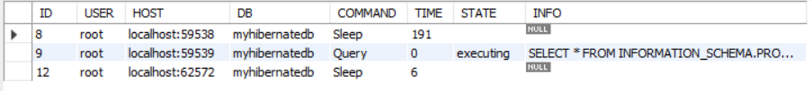
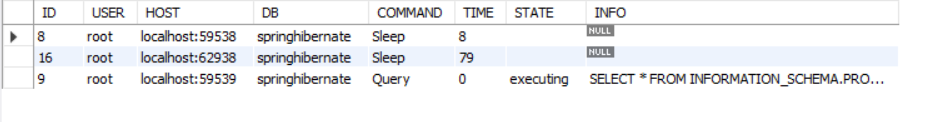

# About Spring ORM
- Spring provides API to easily integrate Spring with ORM frameworks such as Hibernate, JPA(Java Persistence API), JDO(Java Data Objects), Oracle Toplink, iBATIS and many more.
- In hibernate, we need to manage session by our self like and database operation is done, we need to close the session manually. Spring ORM simplifies the management of Hibernate sessions. It can open, flush, and close sessions automatically, integrating with the transaction lifecycle to ensure proper resource management.
- Lets us take an example.
- Before getting into code, first we need to download the dependencies from maven repositories.

```
<!-- https://mvnrepository.com/artifact/org.springframework/spring-context -->
<dependency>
    <groupId>org.springframework</groupId>
    <artifactId>spring-context</artifactId>
    <version>6.1.5</version>
</dependency>

<!-- https://mvnrepository.com/artifact/org.springframework/spring-core -->
<dependency>
    <groupId>org.hibernate</groupId>
    <artifactId>hibernate-core</artifactId>
    <version>6.5.1.Final</version>
</dependency>


<!-- https://mvnrepository.com/artifact/org.springframework/spring-orm -->
<dependency>
    <groupId>org.springframework</groupId>
    <artifactId>spring-orm</artifactId>
    <version>6.1.5</version>
</dependency>

<!-- https://mvnrepository.com/artifact/org.hibernate.orm/hibernate-core -->
<dependency>
    <groupId>org.hibernate.orm</groupId>
    <artifactId>hibernate-core</artifactId>
    <version>6.5.2.Final</version>
</dependency>

	    
<!-- https://mvnrepository.com/artifact/mysql/mysql-connector-java -->
<dependency>
    <groupId>mysql</groupId>
    <artifactId>mysql-connector-java</artifactId>
    <version>8.0.33</version>
</dependency>
```

- Since we are working with Spring 6+ and MySQL we have downloaded it dependencies.
- Now Imagine you're producing a movie. There are several key components involved in making the movie:
    - Production Company: The organization that funds and oversees or supervise the entire movie production process. It provides the resources and infrastructure for the entire movie production process. It coordinates everything, ensuring that the film crew has what they need to shoot the movie
    - Film Crew: The team that handles the actual filming, including the director, camera operators, and actors.
    - Shooting Script: The detailed plan that outlines every scene, dialogue, and shot needed for the movie.
- Now to setup our own movie we require funds or production company , in terms of technology we require a **SessionFactory**. In Hibernate, the **SessionFactory** is like the production company. It manages the sessions (film crews) that perform the work with the database (film shooting). **SessionFactory** is an interface which is implemented by **LocalSessionFactoryBean**.
- **LocalSessionFactoryBean** is shooting script, which details how the movie should be made, scene by scene. It includes all the necessary instructions and settings (like camera angles, dialogue, etc.) that the production company (**SessionFactory**) needs to follow to produce the movie. This is a Spring bean that configures and manages the SessionFactory. It sets up the Hibernate environment, including database connection details and mappings.
- The **TransactionManager** acts like the director of the movie. The director ensures that each scene (transaction) is shot correctly and that the film’s narrative (database operations) proceeds smoothly. If something goes wrong in a scene, the director decides whether to redo the scene (rollback) or proceed with the next scene (commit). The **TransactionManager** manages the lifecycle of transactions. It ensures that all operations within a transaction are committed or rolled back properly. In Spring, it's typically represented by **HibernateTransactionManager**.
- **Session** (Film Crew) The Film Crew, who do the actual filming based on the script and director's instructions. Each session (film crew) handles specific tasks (database operations) like filming a scene. A session represents a single unit of work with the database, like a film crew shooting scenes. It handles interactions with the database, like saving, retrieving, or updating.

>[!NOTE]
> In Spring 6+, we don't use HibernateTemplate. We use SessionFactory.

- Now lets us see how these configurations we need to setup in the configuration XML file.

```
<!-- applicationContext.xml -->

<beans xmlns="http://www.springframework.org/schema/beans"
       xmlns:xsi="http://www.w3.org/2001/XMLSchema-instance"
       xmlns:context="http://www.springframework.org/schema/context"
       xmlns:tx="http://www.springframework.org/schema/tx"
       xsi:schemaLocation="http://www.springframework.org/schema/beans 
           http://www.springframework.org/schema/beans/spring-beans.xsd
           http://www.springframework.org/schema/context 
           http://www.springframework.org/schema/context/spring-context.xsd
           http://www.springframework.org/schema/tx 
           http://www.springframework.org/schema/tx/spring-tx.xsd">

    <!-- Enable annotation-driven transaction management -->
    <tx:annotation-driven transaction-manager="transactionManager" />
    
    <!-- DataSource bean: Providing resources (database connection details) -->
    <bean id="dataSource" class="org.springframework.jdbc.datasource.DriverManagerDataSource">
        <property name="driverClassName" value="com.mysql.cj.jdbc.Driver" />
        <property name="url" value="jdbc:mysql://localhost:3306/springhibernate" />
        <property name="username" value="root" />
        <property name="password" value="Meetpandya40@" />
    </bean>

    <!-- Hibernate properties: Configuration settings -->
    <bean id="hibernateProperties" class="org.springframework.beans.factory.config.PropertiesFactoryBean">
        <property name="properties">
            <props>
                <prop key="hibernate.dialect">org.hibernate.dialect.MySQL8Dialect</prop>
                <prop key="hibernate.show_sql">true</prop>
                <prop key="hibernate.hbm2ddl.auto">create</prop>
            </props>
        </property>
    </bean>

    <!-- SessionFactory bean: Coordinating the overall database interaction -->
    <bean id="factory" class="org.springframework.orm.hibernate5.LocalSessionFactoryBean">
        <property name="dataSource" ref="dataSource" />
        <property name="hibernateProperties" ref="hibernateProperties" />
        <!-- Scanning for annotated entity classes -->
        <property name="packagesToScan" value="com.spring.orm.entities" />
    </bean>

    <!-- Injecting SessionFactory into StudentDao -->
    <bean id="beanOfStudentDao" class="com.spring.orm.dao.StudentDao">
        <property name="sessionFactory" ref="factory" />
    </bean>
    
    <!-- Injecting dao into service -->
     <bean id="beanOfStudentService" class="com.spring.orm.service.StudentService">
        <property name="studentdao" ref="beanOfStudentDao" />
    </bean>
     

    <!-- Transaction manager: Ensures transaction management -->
    <bean id="transactionManager" class="org.springframework.orm.hibernate5.HibernateTransactionManager">
        <property name="sessionFactory" ref="factory" />
    </bean>


</beans>
```

- So our entity is Student class defined under `com.spring.orm.entities` package.

```
package com.spring.orm.entities;

import jakarta.persistence.*;

@Entity
@Table(name = "student_information")
public class Student{

	@Id
	@Column(name = "student_id")
	private int rollnumber;
	
	@Column(name = "student_name")
	private String studentName;
	
	@Column(name = "student_city")
	private String studentCity;

	public int getRollnumber() {
		return rollnumber;
	}

	public void setRollnumber(int rollnumber) {
		this.rollnumber = rollnumber;
	}

	public String getStudentName() {
		return studentName;
	}

	public void setStudentName(String studentName) {
		this.studentName = studentName;
	}

	public String getStudentCity() {
		return studentCity;
	}

	public void setStudentCity(String studentCity) {
		this.studentCity = studentCity;
	}
	
}
```

- We have defined a service layer as well as dao layer for student entity.

```
package com.spring.orm.service;

import com.spring.orm.dao.StudentDao;
import com.spring.orm.entities.Student;

import jakarta.transaction.Transactional;

public class StudentService {

	private StudentDao studentdao;

	public StudentDao getStudentdao() {
		return studentdao;
	}

	public void setStudentdao(StudentDao studentdao) {
		this.studentdao = studentdao;
	}
	
	@Transactional
	public int insertOperation(Student student) {
		return studentdao.insert(student);
	}
}


package com.spring.orm.dao;


import org.hibernate.SessionFactory;

import com.spring.orm.entities.Student;

public class StudentDao{

	private SessionFactory sessionFactory;

	public SessionFactory getsessionFactory() {
		return sessionFactory;
	}

	public void setsessionFactory(SessionFactory sessionFactory) {
		this.sessionFactory = sessionFactory;
	}
	
	public int insert(Student student) {
		Integer i=(Integer) sessionFactory.getCurrentSession().save(student);
		return i;
	}
}
```

- Post execution of main method, our table is created and data is inserted.

```
package com.spring.orm;

import org.springframework.context.ApplicationContext;
import org.springframework.context.support.ClassPathXmlApplicationContext;

import com.spring.orm.entities.Student;
import com.spring.orm.service.StudentService;

public class MainMethod 
{
    public static void main( String[] args )
    {
    	
		ApplicationContext factory = new ClassPathXmlApplicationContext("com/spring/orm/springConfig.xml");

		/**
		 * Singleton and ProtoType
		 */ 
		
		StudentService std=factory.getBean("beanOfStudentService",StudentService.class);
		Student st=new Student();
		st.setRollnumber(1);
		st.setStudentName("Harsh");
		st.setStudentCity("Mumbai");
		
		System.out.println("Rows Affected - "+std.insertOperation(st));
    }
}

Output:
Hibernate: create table student_information (student_id integer not null, student_city varchar(255), student_name varchar(255), primary key (student_id)) engine=InnoDB
Hibernate: insert into student_information (student_city,student_name,student_id) values (?,?,?)
Rows Affected - 1
```

 

- Hold on, the session is closed ? cleared from database? yes, it is managed by `@Transactional` annotation.
- Lets take us example where spring was not in the picture, and only hibernate performs database operations. 
- So we have a table paginator, and below are current session enabled on it.

 

- Lets say we run a session on it and we forgot to close the session, we can see the entry of it.

 

- Lets see this thing using Spring but on another table. Here we will debug on the StudentDao when the insert operation returns.

 

 

- When we check on the student_information table there will be a session created on it. Post completion , transactional will remove the session.

 

 

- This is one of the benefit of using Spring and hibernate.

- Lets us see CRUD operations.
- DAO Code

```
package com.spring.orm.dao;


import java.util.List;

import org.hibernate.SessionFactory;

import com.spring.orm.entities.Student;

public class StudentDao{

	private SessionFactory sessionFactory;

	public SessionFactory getsessionFactory() {
		return sessionFactory;
	}

	public void setsessionFactory(SessionFactory sessionFactory) {
		this.sessionFactory = sessionFactory;
	}
	
	public int insert(Student student) {
		Integer i=(Integer) sessionFactory.getCurrentSession().save(student);
		return i;
	}
	
	public int update(Student student) {
		sessionFactory.getCurrentSession().update(student);
		return 1;
	}
	
	public List<Student> fetchAll(){
		return sessionFactory.getCurrentSession().createQuery("from Student", Student.class).list();
	}
	
	public Student fetchbyId(int id) {
        return sessionFactory.getCurrentSession().get(Student.class, id);

	}
	
	public int delete(int id) {
		Student entity = sessionFactory.getCurrentSession().get(Student.class, id);
        if (entity != null) {
            sessionFactory.getCurrentSession().delete(entity);
            return 1;
        }
        return 0;
	}
}
```

- Service Code

```
package com.spring.orm.service;

import java.util.List;

import com.spring.orm.dao.StudentDao;
import com.spring.orm.entities.Student;

import jakarta.transaction.Transactional;

@Transactional
public class StudentService {

	private StudentDao studentdao;

	public StudentDao getStudentdao() {
		return studentdao;
	}

	public void setStudentdao(StudentDao studentdao) {
		this.studentdao = studentdao;
	}
	
	public int insertOperation(Student student) {
		return studentdao.insert(student);
	}
	
	public int updateData(Student student) {
		return studentdao.update(student);
	}
	
	public Student fetchbyId(int id) {
		return studentdao.fetchbyId(id);
	}
	
	public List<Student> fetchAll(){
		return studentdao.fetchAll();
	}
	
	public int deletedata(int id) {
		return studentdao.delete(id);
	}
}
```

- Post execution of main method

```
package com.spring.orm;

import java.util.List;

import org.springframework.context.ApplicationContext;
import org.springframework.context.support.ClassPathXmlApplicationContext;

import com.spring.orm.entities.Student;
import com.spring.orm.service.StudentService;

public class MainMethod 
{
    public static void main( String[] args )
    {
    	
		ApplicationContext factory = new ClassPathXmlApplicationContext("com/spring/orm/springConfig.xml");

		/**
		 * Singleton and ProtoType
		 */ 
		
		StudentService std=factory.getBean("beanOfStudentService",StudentService.class);
		Student st=new Student();
		st.setRollnumber(1);
		st.setStudentName("Harsh");
		st.setStudentCity("Mumbai");
		
		System.out.println("Rows Affected - "+std.insertOperation(st));
		
		Student st1=new Student();
		st1.setRollnumber(1);
		st1.setStudentCity("Delhi");
		st1.setStudentName("Meet");
		
		System.out.println("Rows Affected - "+std.updateData(st1));
		
		Student st2=std.fetchbyId(1);
		System.out.println(st2.getStudentName());
		
		List<Student> st3=std.fetchAll();
		
		for(Student s: st3) {
			System.out.println(s.getStudentName());
		}

		System.out.println("Deleted row - "+std.deletedata(1));
		
    }
}


Output:
Hibernate: drop table if exists student_information
Hibernate: create table student_information (student_id integer not null, student_city varchar(255), student_name varchar(255), primary key (student_id)) engine=InnoDB
Hibernate: insert into student_information (student_city,student_name,student_id) values (?,?,?)
Rows Affected - 1
Hibernate: update student_information set student_city=?,student_name=? where student_id=?
Rows Affected - 1
Hibernate: select s1_0.student_id,s1_0.student_city,s1_0.student_name from student_information s1_0 where s1_0.student_id=?
Meet
Hibernate: select s1_0.student_id,s1_0.student_city,s1_0.student_name from student_information s1_0
Meet
Hibernate: select s1_0.student_id,s1_0.student_city,s1_0.student_name from student_information s1_0 where s1_0.student_id=?
Hibernate: delete from student_information where student_id=?
Deleted row - 1
```


## Key Features of Spring ORM Using Hibernate:
- Transaction Management: Spring ORM provides declarative transaction management, which can be configured through annotations or XML. This allows for consistent handling of transactions across different data access technologies, including Hibernate.
- Session Management: Spring ORM simplifies the management of Hibernate sessions. It can open, flush, and close sessions automatically, integrating with the transaction lifecycle to ensure proper resource management.
- Exception Handling: Spring ORM translates Hibernate-specific exceptions into a consistent set of data access exceptions. This abstraction allows for a consistent approach to error handling, regardless of the underlying ORM tool.
- Integration with Spring Context: Spring ORM seamlessly integrates Hibernate into the Spring Application Context, allowing Hibernate sessions and transactions to be managed as beans. This enables the use of dependency injection for configuration and resource management.
- Support for Hibernate's Native API and JPA: Spring ORM supports both Hibernate's native API and Java Persistence API (JPA), giving developers the flexibility to choose the approach that best fits their needs.

- Lets learn about [Spring MVC](https://github.com/codophilic/LearnSpring/blob/main/SpringMVC.md)
